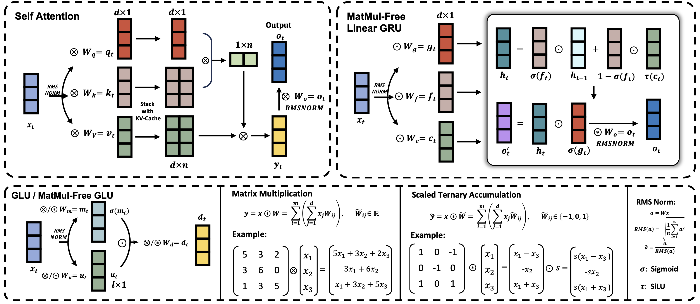
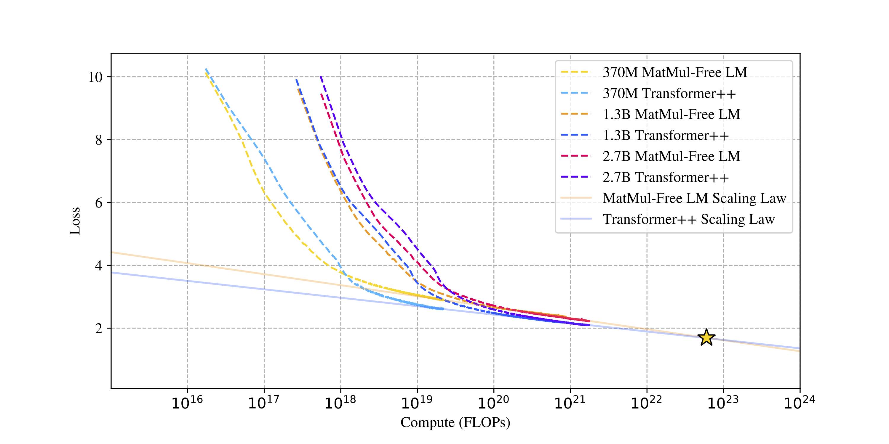

<div align=center>

</div>
<h2 align="center">MatMul-Free LM</h2>
<h5 align="center"> If you like our project, please give us a star ⭐ on GitHub for the latest update.  </h2>
<h5 align="center"> This repo is adapted from <a href="https://github.com/sustcsonglin/flash-linear-attention">flash-linear-attention </a>. </h2>

<h5 align="center">

[](https://huggingface.co/collections/ridger/matmulfree-lm-665f4d2b4e4648756e0dd13c)

# Introduction
<div align=center>

</div>
MatMul-Free LM is a language model architecture that eliminates the need for Matrix Multiplication (MatMul) operations. This repository provides an implementation of MatMul-Free LM that is compatible with the 🤗 Transformers library.

# Scaling Law
<div align=center>

</div>
We evaluate how the scaling law fits to the 370M, 1.3B and 2.7B parameter models in both Transformer++ and our model. For a fair comparison, each operation is treated identically, though our model uses more efficient ternary weights in some layers. Interestingly, the scaling projection for our model exhibits a steeper descent compared to Transformer++, suggesting our architecture is more efficient in leveraging additional compute to improve performance.

# Installation

The following requirements should be satisfied 
- [PyTorch](https://pytorch.org/) >= 2.0
- [Triton](https://github.com/openai/triton) >=2.2
- [einops](https://einops.rocks/)

```sh
pip install -U git+https://github.com/ridgerchu/matmulfreellm
```

# Usage

All of the pretrained models currently available can be found in [`This huggingface collection`](https://huggingface.co/collections/ridger/matmulfree-lm-665f4d2b4e4648756e0dd13c).
## Model

We provide the implementations of models that are compatible with 🤗 Transformers library. 
Here's an example of how to initialize a model from the default configs in `matmulfreelm`:
This is a huggingface-compatible libary that you can use such command to initize the model with huggingface `AutoModel`:


```py
>>> from mmfreelm.models import HGRNBitConfig
>>> from transformers import AutoModel
>>> config = HGRNBitConfig()
>>> AutoModel.from_config(config)
HGRNBitModel(
  (embeddings): Embedding(32000, 2048)
  (layers): ModuleList(
    (0): HGRNBitBlock(
      (attn_norm): RMSNorm(2048, eps=1e-06)
      (attn): HGRNBitAttention(
        (i_proj): FusedBitLinear(
          in_features=2048, out_features=2048, bias=False
          (norm): RMSNorm(2048, eps=1e-08)
        )
        (f_proj): FusedBitLinear(
          in_features=2048, out_features=2048, bias=False
          (norm): RMSNorm(2048, eps=1e-08)
        )
        (g_proj): FusedBitLinear(
          in_features=2048, out_features=2048, bias=False
          (norm): RMSNorm(2048, eps=1e-08)
        )
        (g_norm): FusedRMSNormSwishGate()
        (o_proj): FusedBitLinear(
          in_features=2048, out_features=2048, bias=False
          (norm): RMSNorm(2048, eps=1e-08)
        )
      )
      (mlp_norm): RMSNorm(2048, eps=1e-06)
      (mlp): HGRNBitMLP(
        (gate_proj): FusedBitLinear(
          in_features=2048, out_features=11264, bias=False
          (norm): RMSNorm(2048, eps=1e-08)
        )
        (down_proj): FusedBitLinear(
          in_features=5632, out_features=2048, bias=False
          (norm): RMSNorm(5632, eps=1e-08)
        )
        (act_fn): SiLU()
      )
    )
    
)
>>> 

```

## Generation

Upon successfully pretraining a model, it becomes accessible for generating text using the 🤗 text generation APIs.
In the following, we give a generation example in `generate.py`:

```py
import os
os.environ["TOKENIZERS_PARALLELISM"] = "false"
import mmfreelm
from transformers import AutoModelForCausalLM, AutoTokenizer
#Change here to our open-sourced model
name = ''
tokenizer = AutoTokenizer.from_pretrained(name)
model = AutoModelForCausalLM.from_pretrained(name).cuda().half()
input_prompt = "In a shocking finding, scientist discovered a herd of unicorns living in a remote, "
input_ids = tokenizer(input_prompt, return_tensors="pt").input_ids.cuda()
outputs = model.generate(input_ids, max_length=32,  do_sample=True, top_p=0.4, temperature=0.6)
print(tokenizer.batch_decode(outputs, skip_special_tokens=True)[0])
```


# Citation
If you find this repo useful, please consider citing our works:
```bib
@article{zhu2024scalable,
title={Scalable MatMul-free Language Modeling},
author={Zhu, Rui-Jie and Zhang, Yu and Sifferman, Ethan and Sheaves, Tyler and Wang, Yiqiao and Richmond, Dustin and Zhou, Peng and Eshraghian, Jason K},
journal={arXiv preprint arXiv:2406.02528},
year={2024}
}
```
